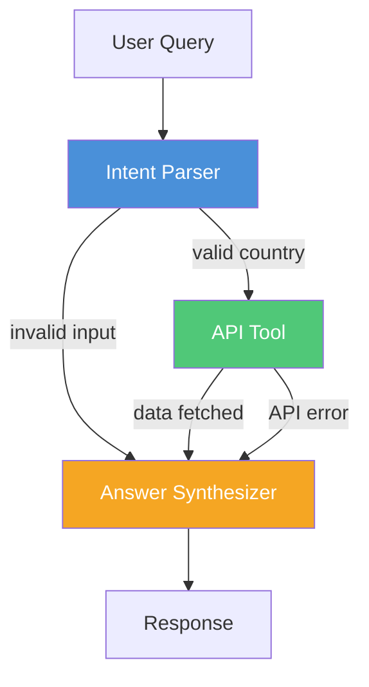

# CountryLens

An AI agent that answers questions about countries using real-time public data. Built with LangGraph and FastAPI.

Ask it anything like *"What is the population of Germany?"* or *"What currency does Japan use?"* and it pulls live data from the REST Countries API, then gives you a clean, grounded answer.

## Live Demo

> **Hosted URL:** [coming soon after deployment]

## Architecture

The agent follows a 3-step pipeline built as a LangGraph state machine. Each step has a single responsibility — no monolithic prompt chains.



| Node | What it does | Uses LLM? |
|------|-------------|-----------|
| **Intent Parser** | Extracts country name and user intent from natural language | Yes (structured JSON output) |
| **API Tool** | Calls REST Countries API with retry + cache | No |
| **Answer Synthesizer** | Formats a natural language response grounded in API data | Yes |

## Design Decisions

| Decision | Choice | Why |
|----------|--------|-----|
| LLM for intent parsing | Groq (Llama 3.3 70B) | Fast inference, handles typos and varied phrasing naturally |
| Validation | Conditional edge in LangGraph | Skips API call entirely on bad input — saves time and API quota |
| HTTP client | httpx (async) | Non-blocking, plays well with FastAPI's async stack |
| Retry logic | Exponential backoff (max 3) | Handles transient API failures without hammering the endpoint |
| Caching | In-memory TTL cache (cachetools) | Avoids redundant API calls for repeated queries, no DB needed |
| Error handling | Graceful at every node | User always gets a useful message, never a raw traceback |

## Tech Stack

- **Agent Framework:** LangGraph
- **LLM:** Groq (Llama 3.3 70B Versatile)
- **API Framework:** FastAPI + Uvicorn
- **HTTP Client:** httpx (async)
- **Caching:** cachetools (TTL-based)
- **Validation:** Pydantic v2
- **Deployment:** Docker + Render

## Project Structure

```
CountryLens/
├── app/
│   ├── main.py              # FastAPI app, endpoints, CORS, logging
│   ├── config.py             # Environment settings (Pydantic BaseSettings)
│   ├── agent/
│   │   ├── graph.py          # LangGraph workflow definition
│   │   ├── nodes.py          # Intent parser, fetch, synthesizer
│   │   ├── state.py          # TypedDict state schema
│   │   └── tools.py          # REST Countries API client + cache + retry
│   └── models/
│       └── schemas.py        # Request/response Pydantic models
├── tests/
│   └── test_agent.py
├── Dockerfile
├── requirements.txt
├── .env.example
└── README.md
```

## Run Locally

```bash
git clone https://github.com/AyushSid28/CountryLens.git
cd CountryLens

python -m venv venv
source venv/bin/activate

pip install -r requirements.txt

cp .env.example .env
# Add your GROQ_API_KEY to .env

uvicorn app.main:app --reload --port 8000
```

API docs available at `http://localhost:8000/docs`

## Run with Docker

```bash
docker build -t countrylens .
docker run -p 8000:8000 --env-file .env countrylens
```

## API Endpoints

### POST /query

```json
{
  "question": "What is the capital and population of Brazil?"
}
```

**Response:**

```json
{
  "answer": "The capital of Brazil is Brasília and its population is approximately 212.6 million.",
  "data": {
    "name": "Brazil",
    "capital": ["Brasília"],
    "population": 212559417,
    "region": "Americas"
  },
  "metadata": {
    "country_queried": "Brazil",
    "response_time_ms": 1243.5,
    "cached": false,
    "model": "llama-3.3-70b-versatile"
  }
}
```

### GET /health

Returns `{"status": "healthy", "version": "1.0.0"}`

## Known Limitations

- **Single country per query** — asking about multiple countries in one question may only return data for the first one detected
- **LLM dependency** — intent parsing and answer synthesis require an LLM call, adding latency (~1-2s per query)
- **In-memory cache** — cache resets on server restart since there's no persistent storage
- **REST Countries API** — the agent is only as accurate as the upstream data source

## Production Considerations

If this were a real production service, I'd add:

- **Redis** for distributed caching across multiple instances
- **Rate limiting** on the `/query` endpoint to prevent abuse
- **Structured JSON logging** for observability (e.g., with structlog)
- **OpenTelemetry tracing** across LangGraph nodes for debugging agent flows
- **Input sanitization** and prompt injection guards
- **Health check** that verifies LLM and API connectivity, not just uptime
