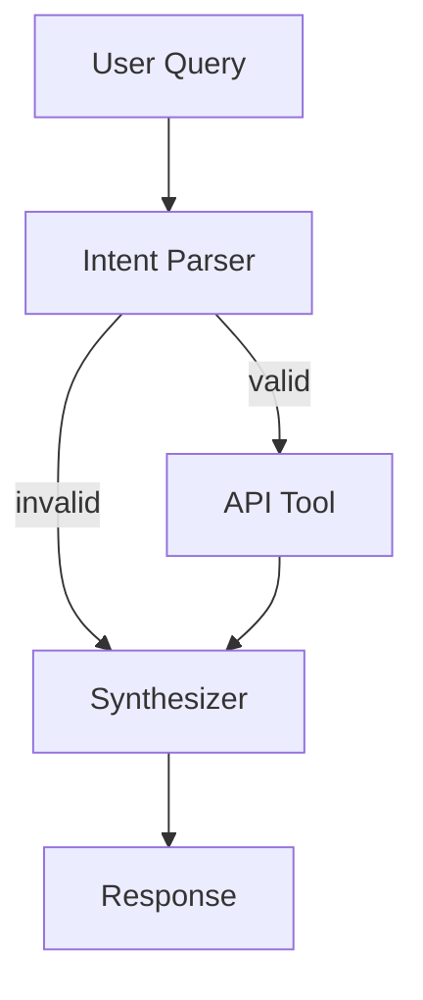

# CountryLens

AI agent that answers questions about countries. Ask stuff like "What's the capital of France?" or "Tell me about Japan" and it fetches real data from the REST Countries API and responds in natural language.

Built with LangGraph, FastAPI, and Groq.

## Live Demo

> **URL:** https://countrylens.onrender.com/

## How it works

Three-step LangGraph pipeline:



1. **Intent Parser** — LLM extracts country name and what the user is asking for (structured JSON output)
2. **API Tool** — hits REST Countries API, handles retries and caching (no LLM here, pure code)
3. **Synthesizer** — LLM takes the raw API data and writes a clean answer, only using the fetched data

If the intent parser can't find a country or the API fails, it skips straight to the synthesizer with an error message instead of crashing.

## Why I made these choices

- **Groq (Llama 3.3 70B)** for LLM — fast inference, free tier works
- **httpx async** — non-blocking, fits FastAPI's async model
- **Exponential backoff on retries** — don't hammer the API when it's struggling
- **TTL cache (cachetools)** — same country asked twice? second response is instant from cache
- **Conditional edges in LangGraph** — bad input skips the API call entirely

## Setup

```bash
git clone https://github.com/AyushSid28/CountryLens.git
cd CountryLens
python -m venv venv
source venv/bin/activate
pip install -r requirements.txt
cp .env.example .env   # add your GROQ_API_KEY
uvicorn app.main:app --reload --port 8000
```

Open `http://localhost:8000` for the UI or `http://localhost:8000/docs` for Swagger.

### Docker

```bash
docker build -t countrylens .
docker run -p 8000:8000 --env-file .env countrylens
```

## API

**POST /query**
```json
// request
{ "question": "What is the capital and population of Brazil?" }

// response
{
  "answer": "The capital of Brazil is Brasília with a population of about 212.5 million.",
  "data": { "name": "Brazil", "capital": ["Brasília"], "population": 212559417 },
  "metadata": { "country_queried": "Brazil", "response_time_ms": 1243.5, "cached": false }
}
```

**GET /health** — returns `{"status": "healthy"}`

## Project structure

```
app/
├── main.py           # FastAPI endpoints
├── config.py         # env settings
├── agent/
│   ├── graph.py      # LangGraph workflow
│   ├── nodes.py      # intent parser, fetch, synthesizer
│   ├── state.py      # state schema
│   └── tools.py      # API client + cache + retry
└── models/
    └── schemas.py    # pydantic models
```

## Known limitations

- Only handles one country per query
- LLM calls add ~1-2s latency per request
- Cache is in-memory so it resets on restart
- Accuracy depends on REST Countries API data

## What I'd add for production

- Redis for distributed cache
- Rate limiting on /query
- OpenTelemetry tracing across nodes
- Prompt injection guards
- Health check that actually pings the LLM and API
